# *Training*

Esta rama contiene el contenido del [*training*](https://gitlab.com/acubesat/ops/yamcs-training) creado por [**AcubeSAT**](https://gitlab.com/acubesat) para el software **YAMCS**.

El propósito es familiazizarse con el software **YAMCS** mediante una lista de tareas e instrucciones. Las tareas mencionadas se deben realizar en el orden establecido.

## A tener en cuenta

Es recomendable tener a mano la [guía del desarrollador](https://gitlab.com/acubesat/ops/yamcs-instance/-/wikis/0.-Introduction-and-Contents) de YAMCS.

En este caso se va a trabajar principalmente con el lenguaje **XML** (principalmente para definir que significan los datos), por lo tanto, es recomendable seguir las indicaciones de instalación de software del repositorio del [*training* de AcubeSAT](https://gitlab.com/acubesat/ops/yamcs-training#overview-of-the-training)

En un lenguaje de etiquetas como `XML` es importante tener en cuenta algunos detalles como el autocierre en etiquetas usando **/** --> `< ... />`

También se recomiendan las siguientes extensiones de **vscode**:
* XML Language Support by Red Hat
* Git Graph
* Better Comments

## Guía del *training*

Consta de [11 pasos](https://gitlab.com/acubesat/ops/yamcs-training/-/wikis/New-member-YAMCS-Training-Tasks):

1. [Crear tipos de datos enumerados](https://gitlab.com/acubesat/ops/yamcs-training/-/issues/1)
2. [Crear una estructura utilizando *AggregateParameterType*](https://gitlab.com/acubesat/ops/yamcs-training/-/issues/2) 
3. [(opcional) Crear un parámetro con codificación de tiempo personalizada](https://gitlab.com/acubesat/ops/yamcs-training/-/issues/3)
4. [Crear un contenedor para el encabezado TM principal](https://gitlab.com/acubesat/ops/yamcs-training/-/issues/4)
5. [Crear un contenedor TM personalizado](https://gitlab.com/acubesat/ops/yamcs-training/-/issues/5)
6. [Crear un TM para leer estructuras de mantenimiento](https://gitlab.com/acubesat/ops/yamcs-training/-/issues/6)
7. [Crear un TC [3,1]](https://gitlab.com/acubesat/ops/yamcs-training/-/issues/7)
8. [Utilizar un parámetro de matriz en un TM](https://gitlab.com/acubesat/ops/yamcs-training/-/issues/8)
9. [Crear un enlace de datos UDP y TCP sencillo](https://gitlab.com/acubesat/ops/yamcs-training/-/issues/9)
10. [(opcional) Crear un servicio sencillo](https://gitlab.com/acubesat/ops/yamcs-training/-/issues/10)
11. [Cambiar el protocolo IP de UDP a TCP para el simulador](https://gitlab.com/acubesat/ops/yamcs-training/-/issues/11)

### Paso 1:

Crea dos tipos de datos enumerados en el archivo ```dt.xml```.

1. Crea una [*Enumerated Parameter Type*](https://gitlab.com/acubesat/ops/yamcs-instance/-/wikis/1.-Parameters-and-Arguments#the-enumerated-parameter-type) que se utilizará como el *Data Type* del parámetro «*Packet Type*» del [*Packet Primary Header*](https://ccsds.org/Pubs/133x0b2e2.pdf#page=32).

**Nota**: El documento del estándar **CCSDS 133.0-B-2** (de donde sale el «*Packet Type*» del *Packet Primary Header*) no es el del repositorio original. En el repositorio original se hacia referencia a **CCSDS 133.0-B-1**, actualmente desfasado.

```
<xtce:EnumeratedParameterType name="PacketType">
    <xtce:IntegerDataEncoding sizeInBits="1"></xtce:IntegerDataEncoding>
    <xtce:EnumerationList>
        <xtce:Enumeration value="0" label="TM" />
        <xtce:Enumeration value="1" label="TC" />
    </xtce:EnumerationList>
</xtce:EnumeratedParameterType>
```

2. Crea una [*Enumerated Parameter Type*](https://gitlab.com/acubesat/ops/yamcs-instance/-/wikis/1) que se utilizará como el *Data Type* del parámetro «*Application Process Identifier*» (APID) del [*Packet Primary Header*](https://ccsds.org/Pubs/133x0b2e2.pdf#page=32). Tenga en cuenta que, en este caso, las aplicaciones se refieren a los diferentes subsistemas del proyecto AcubeSAT (ordenador de a bordo, comunicaciones, ADCS, Science Union y estación terrestre) y que **puede elegir los valores que desee**.

```
<xtce:EnumeratedParameterType name="APID">
    <xtce:IntegerDataEncoding sizeInBits="11"></xtce:IntegerDataEncoding>
    <xtce:EnumerationList>
        <xtce:Enumeration value="1" label="OBC" />
        <xtce:Enumeration value="2" label="COMMS" />
        <xtce:Enumeration value="3" label="ADCS" />
        <xtce:Enumeration value="4" label="SU" />
        <xtce:Enumeration value="5" label="GS" />
        <!-- en IDLE tienen que estar todos los bits a 1-->
        <xtce:Enumeration value="2047" label="IdlePacket" />
    </xtce:EnumerationList>
</xtce:EnumeratedParameterType>
```

**Nota**: Si no encuentra el tamaño en bits de los parámetros solicitados, consulte también la norma ECSS, ya que es posible que se mencione allí.

### Paso 2:

Un parámetro agregado (*Aggregate*) es algo parecido a una estructura de C. Contiene una estructura de parámetros. Los contenedores (*Containers*) ofrecen una funcionalidad similar, aunque se utilizan para construir la secuencia de parámetros TC y TM. Se trata de una capa de abstracción superior. Consulte las secciones [4.3.2.4.11](https://public.ccsds.org/Pubs/660x1g2.pdf#page=151) y [5.4](https://public.ccsds.org/Pubs/660x1g2.pdf#page=151) de la descripción de elementos de XTCE. Consulte también la página wiki sobre el [tipo agregado](https://gitlab.com/acubesat/ops/yamcs-instance/-/wikis/1.-Parameters-and-Arguments#the-aggregate-parameter-type).
Esta tarea consiste en crear una estructura «*AggregateParameterType*» que contenga los siguientes miembros:

| Nombre del parámetro | Tipo |
|--------------  |--------------|
| parameter_ID | parameter_ID |
| samples | uint16_t |
| max_value | float | 
| max_time | uint32_t |
| min_value | float | 
| min_time | uint32_t | 
| standard_deviation | float |


donde ```parameter_ID``` ya está definido en ```dt.xml```

```
<xtce:AggregateParameterType name="sample_structure">
    <xtce:MemberList>
        <xtce:Member typeRef="parameter_ID" name="parameter_ID"></xtce:Member>
        <xtce:Member typeRef="uint16_t" name="samples"></xtce:Member>
        <xtce:Member typeRef="float_t" name="max_value"></xtce:Member>
        <xtce:Member typeRef="uint32_t" name="max_time"></xtce:Member>
        <xtce:Member typeRef="float_t" name="min_value"></xtce:Member>
        <xtce:Member typeRef="uint32_t" name="min_time"></xtce:Member>
        <xtce:Member typeRef="float_t" name="standard_deviation"></xtce:Member>
    </xtce:MemberList>
</xtce:AggregateParameterType>
```

### Paso 3:

El ordenador del satélite no dispone de un reloj integrado. Mide el tiempo utilizando los relojes internos de la unidad microcontroladora (MCU) y lo hace mediante un parámetro de entero sin signo de 32 bits. Este reloj realiza un recuento cada 0,1 s y definimos como 0 la fecha 1/1/2022 00:00:00:000 (hh:mm:ss::ms). Un valor de 1 significaría 1/1/2022 00:00:00:100, un valor de 2 -> 1/1/2022 00:00:00:200, etc. Debe definir un parámetro que convierta esta codificación de tiempo personalizada (CUC) a UNIX. La hora UNIX es el formato de hora utilizado por la mayoría de los ordenadores modernos, sistemas Linux, etc., y el recuento comienza en la Época UNIX, el 1 de enero de 1970 a UTC.

Puede utilizar un [4.3.2.4.9](https://public.ccsds.org/Pubs/660x1g2.pdf#page=146) con un elemento «[*AbsoluteTimeParameterType*](https://gitlab.com/acubesat/ops/yamcs-instance/-/wikis/1.-Parameters-and-Arguments#the-absolute-time-parameter-type)» o un simple entero con un elemento «[*IntegerDataEncoding*](https://gitlab.com/acubesat/ops/yamcs-instance/-/wikis/1.-Parameters-and-Arguments#the-integer-data-encoding-element)» utilizando un [4.3.2.2.6.3](https://public.ccsds.org/Pubs/660x1g2.pdf#page=86) *PolynomialCalibrator*.

#### Solución con *IntegerDataEncoding*
```
<xtce:AbsoluteTimeParameterType name="custom_time_encoding_parameter">
    <!-- offset="1640995200" porque offset="0" implica 
        1/1/1970 00:00:00:000 (hh:mm:ss::ms) UTC-->
    <xtce:Encoding scale="10E-1" offset="1640995200">
        <xtce:IntegerDataEncoding sizeInBits="32"></xtce:IntegerDataEncoding>
    </xtce:Encoding>
    <xtce:ReferenceTime>
        <xtce:Epoch>UNIX</xtce:Epoch>
    </xtce:ReferenceTime>
</xtce:AbsoluteTimeParameterType>
```

👁️ Los pasos **1**, **2**, y **3** no se materializan en la interfaz web. A partir de ahora se comenzarán a observar cambios en la interfaz web.

### Paso 4:
Crea un contenedor [4.3.4](https://public.ccsds.org/Pubs/660x1g2.pdf#page=175) (o la sección 5.4 del [documento](https://public.ccsds.org/Pubs/660x1g2.pdf#page=237) «XTCE Element Description») en el archivo ```pus.xml``` que contenga todos los parámetros del *Primary TM Header* y otro contenedor para el *Secondary TM Header* (consulta la sección [7.4](https://ecss.nl/wp-content/uploads/2016/06/ECSS-E-ST-70-41C15April2016.pdf#page=438) de la norma ECSS y también el archivo [```README.md```](https://gitlab.com/acubesat/ops/yamcs-training/-/blob/main/README.md) para una mejor visualización).

Un *container* es simplemente un grupo de parámetros (u otros contenedores) que se utiliza más de una vez en diferentes comandos o telemetría. Consulte también la página wiki sobre los [*container*](https://gitlab.com/acubesat/ops/yamcs-instance/-/wikis/2.-Containers).

* Todos los parámetros deben definirse en el mismo archivo (archivo ```pus.xml```).
* Añada nuevos tipos de datos para los parámetros del encabezado primario al archivo ```dt.xml```.


#### *Primary TM Header*
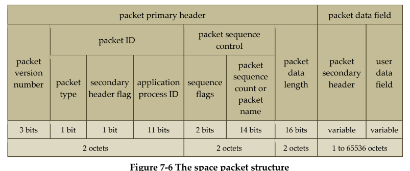

El ***packet primary header*** se ha definido en este caso usando un contenedor compuesto de 2 parámetros y 2 contenedores. 
* **Contenedores**: Están definidos todos juntos en el archivo `pus.xml` como se muestra en la siguiente sección de código

```
<xtce:SequenceContainer name="PH">
     <xtce:EntryList>
         <xtce:ParameterRefEntry parameterRef="version"/>
         <xtce:ContainerRefEntry containerRef="packet_id"/>
         <xtce:ContainerRefEntry containerRef="packet_sequence_control"/>
         <xtce:ParameterRefEntry parameterRef="packet_data_length"/>
     </xtce:EntryList>
 </xtce:SequenceContainer>

 <xtce:SequenceContainer name="packet_id">
     <xtce:EntryList>
         <xtce:ParameterRefEntry parameterRef="packet_type"/>
         <xtce:ParameterRefEntry parameterRef="secondary_header_flag"/>
         <xtce:ParameterRefEntry parameterRef="application_process_id"/>
     </xtce:EntryList>
 </xtce:SequenceContainer>
 
 <xtce:SequenceContainer name="packet_sequence_control">
     <xtce:EntryList>
         <xtce:ParameterRefEntry parameterRef="sequence_flags"/>
         <xtce:ParameterRefEntry parameterRef="packet_sequence_count"/>
     </xtce:EntryList>
 </xtce:SequenceContainer>
```

* **Parámetros** definidos en el **set de parámetros** de `pus.xml`. Notar que los tipos de parámetros (`uint3_t` y `uint16_t`) están definidos en el archivo `dt.xml`

```
<xtce:Parameter parameterTypeRef="dt/uint3_t" name="version"/>
<xtce:Parameter parameterTypeRef="dt/uint16_t" name="packet_data_length"/>
```
```
<xtce:IntegerParameterType name="uint16_t" signed="false">
    <xtce:IntegerDataEncoding encoding="unsigned" sizeInBits="16" />
</xtce:IntegerParameterType>
.
.
.
<xtce:IntegerParameterType name="uint3_t" signed="false">
    <xtce:IntegerDataEncoding encoding="unsigned" sizeInBits="3" />
</xtce:IntegerParameterType>
```


#### *Secondary TM Header*
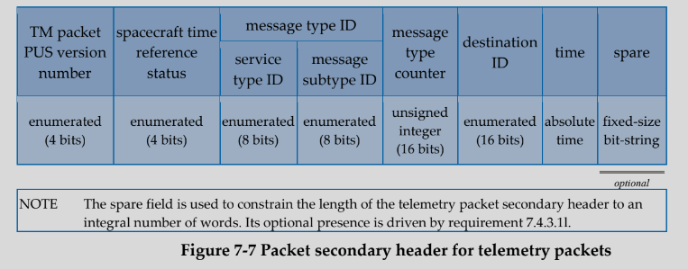

El ***packet secondary header*** se ha definido en este caso usando un contenedor compuesto de 5 parámetros y 1 contenedor. Ocurre los mismo que antes con los contenedores y archivos en cuanto a la distribución de archivos se refiere.

```
<xtce:SequenceContainer name="SH">
    <xtce:EntryList>
        <xtce:ParameterRefEntry parameterRef="tm_PUS_version"/>
        <xtce:ParameterRefEntry parameterRef="spacecraft_time_reference_status"/>
        <xtce:ContainerRefEntry containerRef="message_type_id"/>
        <xtce:ParameterRefEntry parameterRef="message_type_counter"/>
        <xtce:ParameterRefEntry parameterRef="destination_id"/>
        <xtce:ParameterRefEntry parameterRef="time"/>
    </xtce:EntryList>
</xtce:SequenceContainer>

<xtce:SequenceContainer name="message_type_id">
    <xtce:EntryList>
        <xtce:ParameterRefEntry parameterRef="service_type_id" />
        <xtce:ParameterRefEntry parameterRef="message_subtype_id" />
    </xtce:EntryList>
</xtce:SequenceContainer>
```

#### Resultados

Todas estas modificaciones de código han añadido cambios en la interfaz web. 

| Antes de las modificaciones | Después de las modificaciones |
|          --------------     |         --------------        |
|  | 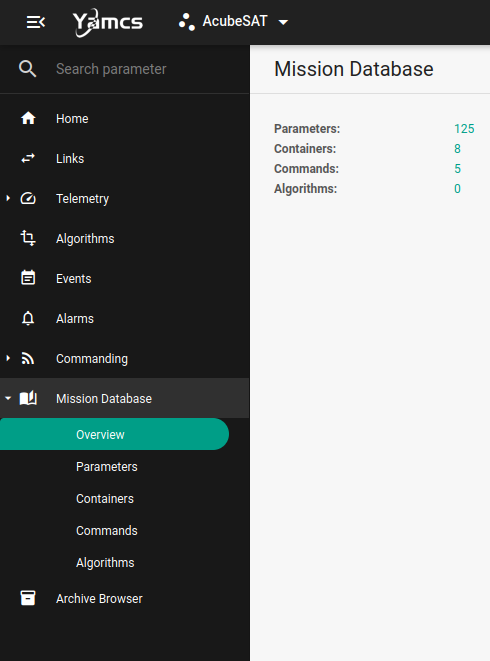 |

Estos cambios han añadido:

* 15 parámetros

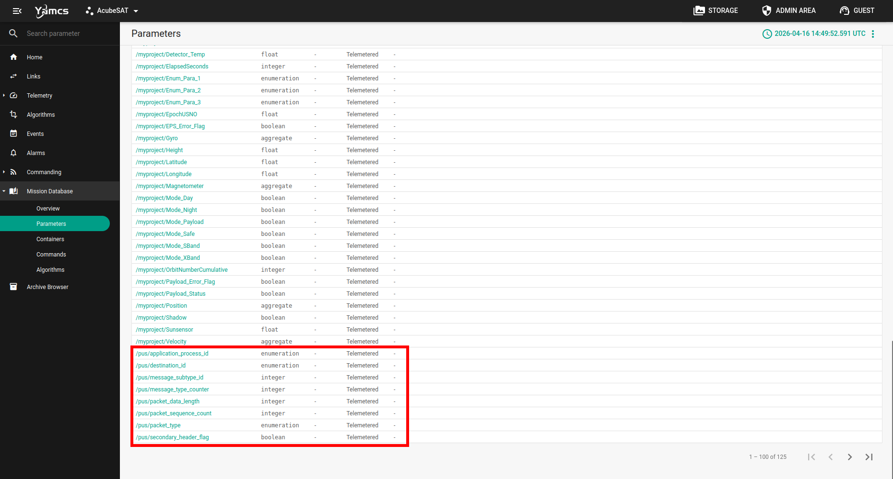
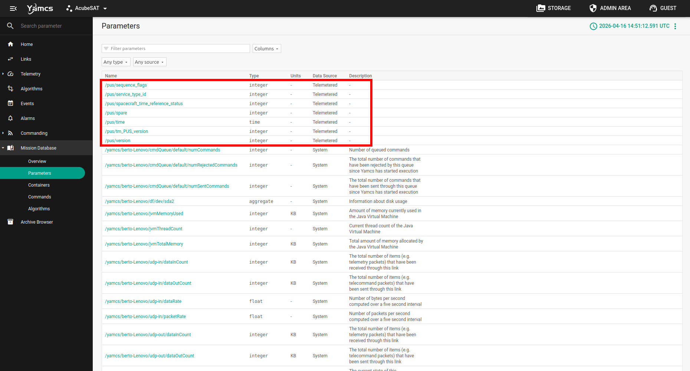

* 5 contenedores

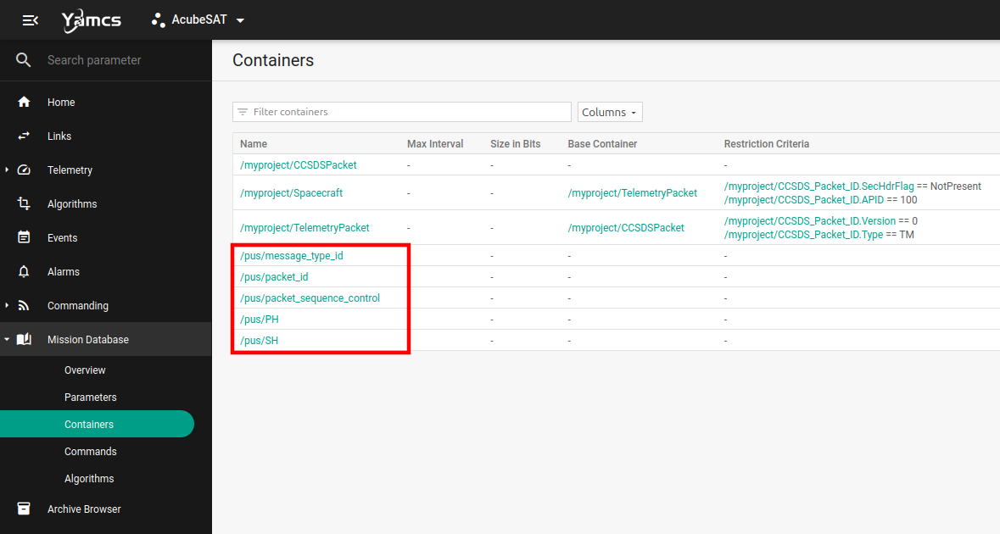

### Paso 5:
Crea un [*TM[200,100] container*](https://ccsds.org/Pubs/660x1g2.pdf#page=229) (apartado 5.2 del documento).

Crea un contenedor «TM_header», que incluya los encabezados TM primario y secundario de la tarea [n.º4](https://gitlab.com/acubesat/ops/yamcs-training/-/issues/4), y utilízalo como ```BaseContainer```.

El contenedor tendrá 3 parámetros:
1. parameter (tipo uint16_t)
2. flag (tipo booleano)
3. time (tipo de parámetro de tiempo absoluto creado en la tarea [n.º3](https://gitlab.com/acubesat/ops/yamcs-training/-/issues/3))

El código que crea el contenedor es el siguiente:

```
<xtce:SequenceContainer name="TM_200_100">
    <xtce:EntryList>
        <xtce:ParameterRefEntry parameterRef="time"/>
        <xtce:ParameterRefEntry parameterRef="flag"/>
        <xtce:ParameterRefEntry parameterRef="parameter"/>
    </xtce:EntryList>
    <xtce:BaseContainer containerRef="TM_header">
        <xtce:RestrictionCriteria>
            <xtce:ComparisonList>
                <xtce:Comparison value="200" parameterRef="service_type_id"/>
                <xtce:Comparison value="100" parameterRef="message_subtype_id"/>
            </xtce:ComparisonList>
        </xtce:RestrictionCriteria>
    </xtce:BaseContainer>
</xtce:SequenceContainer>

<xtce:SequenceContainer name="TM_header" abstract="true">
    <xtce:EntryList>
        <xtce:ContainerRefEntry containerRef="PH"/>
        <xtce:ContainerRefEntry containerRef="SH"/>
    </xtce:EntryList>
</xtce:SequenceContainer>
```

Se han tenido que añadir 2 parámetros al set de parámetros:

```
<xtce:Parameter parameterTypeRef="dt/bool_t" name="flag"/>
<xtce:Parameter parameterTypeRef="dt/uint16_t" name="parameter"/>
```

#### Resultados

Todas estas modificaciones de código han añadido cambios en la interfaz web. 

| Antes de las modificaciones | Después de las modificaciones |
|          --------------     |         --------------        |
|  | 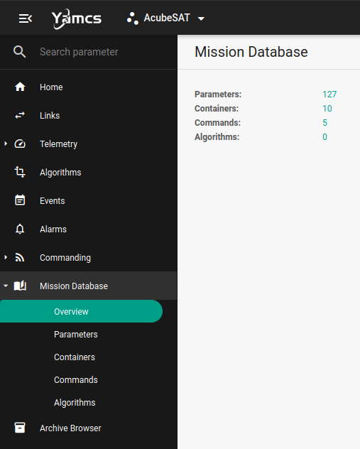 |

Estos cambios han añadido:

* 2 parámetros

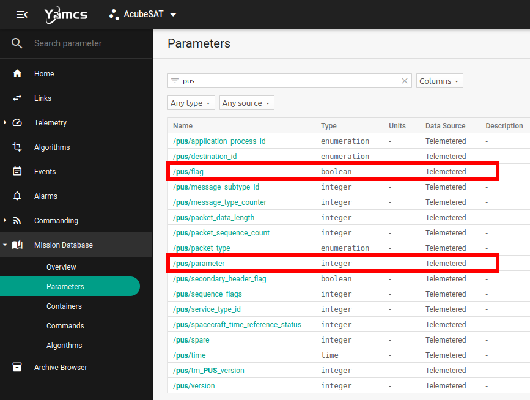

* 2 contenedores

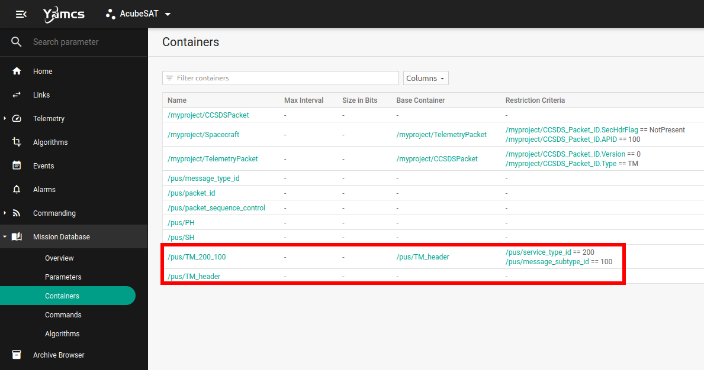

### Paso 6:
Durante la misión, la estación terrestre recibirá algunos parámetros de la nave espacial. Por este motivo, se implementa el TM[3,25], denominado «Informe de parámetros de mantenimiento». Contiene una serie de parámetros y sus valores, muestreados a intervalos de tiempo específicos (véase también el apartado 6.3.3.3 del [documento ECSS](https://cloud.spacedot.gr/index.php/apps/files/?dir=/AcubeSAT/Subsystems/OBC%20-%20On-board%20Computer/Standards&openfile=18872)).
Los parámetros utilizados en la misión se dividen en grupos según diversos criterios, como el intervalo de tiempo de sus muestreos, para formar parte del TM[3,25]. Estos grupos se denominan estructuras de mantenimiento y cada uno tiene un identificador único.
Los TM no solo contienen los datos de telemetría, sino también encabezados, que incluyen algunos datos importantes relativos a la identificación de cada paquete. Utilizando los contenedores que creaste en la tarea [n.º 4](https://gitlab.com/acubesat/ops/yamcs-training/-/issues/4), tu objetivo es crear la estructura del TM[3,25].

* Para implementar el TM[3,25], al igual que en la tarea [n.º 5](https://gitlab.com/acubesat/ops/yamcs-training/-/issues/5), debes definir un `SequenceContainer` con el `BaseContainer` y los `RestrictionCriteria` adecuados. El único elemento `EntryList` del contenedor debe ser un parámetro para el structure_ID (consulta también el apartado 8.3.2.13 del [documento ECSS](https://cloud.spacedot.gr/index.php/apps/files/?dir=/AcubeSAT/Subsystems/OBC%20-%20On-board%20Computer/Standards&openfile=18872)).
* A continuación, crearás un nuevo tipo de enumeración de 8 bits para el structure_ID. Los valores serán todos los ID de las estructuras de mantenimiento. A continuación se muestran los ID y los elementos de las estructuras de mantenimiento.
* También se crearán dos estructuras de mantenimiento en `SequenceContainers` utilizando como `BaseContainer` el contenedor TM[3,25] y como `RestrictionCriteria` el valor del structure_ID. Las dos estructuras de mantenimiento son las siguientes:

1. housekeeping_structure_ID = 0
  * `/AcubeSAT/obdhBoardTemperature1`
  * `/AcubeSAT/obdhBoardTemperature2`
  * `/AcubeSAT/obcMCUTemperature`
  * `/AcubeSAT/obcBootCounter`
  * `/AcubeSAT/obcOnBoardTime`
  * `/AcubeSAT/obcNANDCurrentlyUsedMemoryPartition`
  * `/AcubeSAT/obcMCUSysTick`
  * `/AcubeSAT/CANbus1Load`
  * `/AcubeSAT/CANbus2Load`
  * `/AcubeSAT/activeCAN`
  * `/AcubeSAT/obcNANDFLASHLCLThreshold`
  * `/AcubeSAT/obcMRAMLCLThreshold`
  * `/AcubeSAT/obcNANDFLASHON`
  * `/AcubeSAT/obcMRAMON`

2. housekeeping_structure_ID = 1
  * `/AcubeSAT/magnetometerRawX`
  * `/AcubeSAT/magnetometerRawY`
  * `/AcubeSAT/magnetometerRawZ`
  * `/AcubeSAT/gyroscopeX`
  * `/AcubeSAT/gyroscopeY`
  * `/AcubeSAT/gyroscopeZ`

**¡Ojo!** Algunos de los parámetros aún no están definidos en el archivo `xtce.xml`. Encontrarás toda la información sobre sus definiciones en el [código de OBC](https://gitlab.com/acubesat/obc/cross-platform-software/-/blob/main/inc/Parameters/AcubeSATParameters.hpp?ref_type=heads).
Ya sabes [dónde](https://public.ccsds.org/Pubs/660x1g2.pdf) y [cómo](https://gitlab.com/acubesat/ops/yamcs-instance/-/wikis/2.-Containers) encontrar más información.

#### Código añadido

##### 1. Tipos de parámetros nuevos

Es necesario crear el siguiente tipo de dato para el identificador de la estructura en el archivo `dt.xml`:

```
<xtce:EnumeratedParameterType name="housekeeping_structure_ID">
    <xtce:IntegerDataEncoding sizeInBits="8"/>
    <xtce:EnumerationList>
        <xtce:Enumeration value="0" label="HK_OBC" />
        <xtce:Enumeration value="1" label="HK_ADCS" />
    </xtce:EnumerationList>
</xtce:EnumeratedParameterType>
```

##### 2. Parámetros faltantes en `xtce.xml`

Es necesario añadir los siguientes parámetros para la estructura de valor 0 en el archivo `xtce.xml`:

```
<xtce:Parameter parameterTypeRef="/dt/uint8_t" name="obcNANDCurrentlyUsedMemoryPartition"></xtce:Parameter>
<xtce:Parameter parameterTypeRef="/dt/bool_t" name="activeCAN"></xtce:Parameter>
```

##### 3. Instanciar parámetros

Es necesario instanciar el siguiente parámetros en el set de parámetros del archivo `pus.xml`:

```
<xtce:Parameter parameterTypeRef="dt/housekeeping_structure_ID" name="structure_ID"/>
```

##### 4. Creación de contenedores

Se crea la siguiente jerarquía de contenedores en el archivo `pus.xml`:

```
            <xtce:SequenceContainer name="TM_3_25" abstract="true">

                <xtce:EntryList>
                    <xtce:ParameterRefEntry parameterRef="structure_ID"/>
                </xtce:EntryList>

                <xtce:BaseContainer containerRef="TM_header">
                    <xtce:RestrictionCriteria>
                        <xtce:ComparisonList>
                            <xtce:Comparison value="3" parameterRef="service_type_id"/>
                            <xtce:Comparison value="25" parameterRef="message_subtype_id"/>
                        </xtce:ComparisonList>
                    </xtce:RestrictionCriteria>
                </xtce:BaseContainer>

            </xtce:SequenceContainer>

            <xtce:SequenceContainer name="TM_HK_OBC">

                <xtce:EntryList>
                    <xtce:ParameterRefEntry parameterRef="/AcubeSAT/obdhBoardTemperature1"/> 
                    <xtce:ParameterRefEntry parameterRef="/AcubeSAT/obdhBoardTemperature2"/>
                    <xtce:ParameterRefEntry parameterRef="/AcubeSAT/obcMCUTemperature"/>
                    <xtce:ParameterRefEntry parameterRef="/AcubeSAT/obcBootCounter"/>
                    <xtce:ParameterRefEntry parameterRef="/AcubeSAT/obcOnBoardTime"/>
                    <xtce:ParameterRefEntry parameterRef="/AcubeSAT/obcNANDCurrentlyUsedMemoryPartition"/>
                    <xtce:ParameterRefEntry parameterRef="/AcubeSAT/obcMCUSysTick"/>
                    <xtce:ParameterRefEntry parameterRef="/AcubeSAT/CANbus1Load"/>
                    <xtce:ParameterRefEntry parameterRef="/AcubeSAT/CANbus2Load"/>
                    <xtce:ParameterRefEntry parameterRef="/AcubeSAT/activeCAN"/>
                    <xtce:ParameterRefEntry parameterRef="/AcubeSAT/obcNANDFLASHLCLThreshold"/>
                    <xtce:ParameterRefEntry parameterRef="/AcubeSAT/obcMRAMLCLThreshold"/>
                    <xtce:ParameterRefEntry parameterRef="/AcubeSAT/obcNANDFLASHON"/>
                    <xtce:ParameterRefEntry parameterRef="/AcubeSAT/obcMRAMON"/>
                </xtce:EntryList>

                <xtce:BaseContainer containerRef="TM_3_25">
                    <xtce:RestrictionCriteria>
                        <xtce:ComparisonList>
                            <xtce:Comparison value="0" parameterRef="structure_ID"/>
                        </xtce:ComparisonList>
                    </xtce:RestrictionCriteria>
                </xtce:BaseContainer>

            </xtce:SequenceContainer>

            <xtce:SequenceContainer name="TM_HK_ADCS">

                <xtce:EntryList>
                    <xtce:ParameterRefEntry parameterRef="/AcubeSAT/magnetometerRawX"/> 
                    <xtce:ParameterRefEntry parameterRef="/AcubeSAT/magnetometerRawY"/>
                    <xtce:ParameterRefEntry parameterRef="/AcubeSAT/magnetometerRawZ"/>
                    <xtce:ParameterRefEntry parameterRef="/AcubeSAT/gyroscopeX"/>
                    <xtce:ParameterRefEntry parameterRef="/AcubeSAT/gyroscopeY"/>
                    <xtce:ParameterRefEntry parameterRef="/AcubeSAT/gyroscopeZ"/>
                </xtce:EntryList>

                <xtce:BaseContainer containerRef="TM_3_25">
                    <xtce:RestrictionCriteria>
                        <xtce:ComparisonList>
                            <xtce:Comparison value="1" parameterRef="structure_ID"/>
                        </xtce:ComparisonList>
                    </xtce:RestrictionCriteria>
                </xtce:BaseContainer>

            </xtce:SequenceContainer>
```

#### Resultados:

Todas estas modificaciones de código han añadido cambios en la interfaz web. 

| Antes de las modificaciones | Después de las modificaciones |
|          --------------     |         --------------        |
|  | 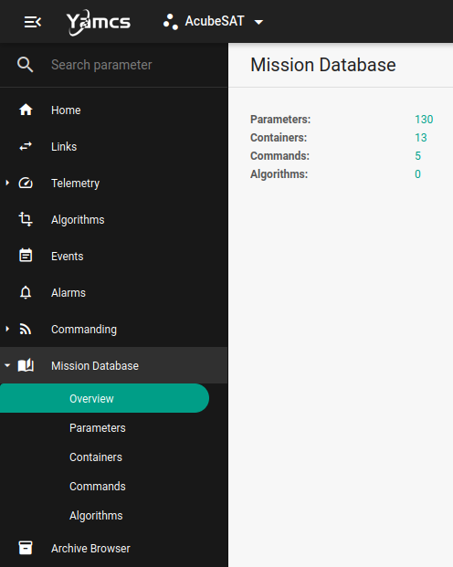 |

Estos cambios han añadido:

* 3 parámetros (1 en `/pus` y los otros 2 en `/AcubeSAT`)

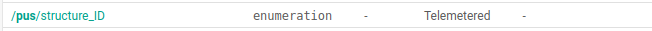
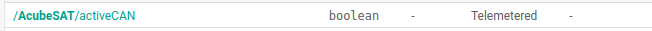
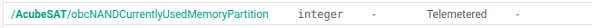


* 3 contenedores

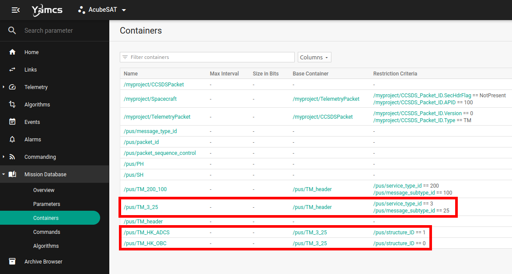