# *Training*

Esta rama contiene el contenido del [*training*](https://gitlab.com/acubesat/ops/yamcs-training) creado por [**AcubeSAT**](https://gitlab.com/acubesat) para el software **YAMCS**.

El propósito es familiazizarse con el software **YAMCS** mediante una lista de tareas e instrucciones. Las tareas mencionadas se deben realizar en el orden establecido.

## A tener en cuenta

Es recomendable tener a mano la [guía del desarrollador](https://gitlab.com/acubesat/ops/yamcs-instance/-/wikis/0.-Introduction-and-Contents) de YAMCS.

En este caso se va a trabajar principalmente con el lenguaje **XML** (principalmente para definir que significan los datos), por lo tanto, es recomendable seguir las indicaciones de instalación de software del repositorio del [*training* de AcubeSAT](https://gitlab.com/acubesat/ops/yamcs-training#overview-of-the-training)

### Sobre la programación de archivos `XML`
En un lenguaje de etiquetas como `XML` es importante tener en cuenta algunos detalles como el autocierre en etiquetas usando **/** --> `< ... />`

Además, se recomiendan las siguientes extensiones de **vscode**:
* XML Language Support by Red Hat: Permite trabajar cómodamente con archivos de tipo `.xml`.
* Git Graph: Genera un árbol de las ramas de git bastante más intuitivo que el terminal.
* Better Comments: Permite identificar en el código los tipos de comentarios según su color a través del archivo de configuración `settings.json`

### Sobre los directorios y archivos del proyecto

#### Directorios:
En este proyecto existen principalmente los siguientes directorios:
* `src/main/java`: Contiene el código fuente personalizado en Java para extender las funcionalidades base de YAMCS. Aquí se encuentran archivos como `MyPacketPreprocessor.java` (encargado de preprocesar y extraer información básica de los paquetes de telemetría entrantes, como la longitud o el *timestamp*) y `MyCommandPostprocessor.java` (que se ejecuta justo antes de enviar un telecomando para calcular automáticamente campos dinámicos, como el contador de secuencia o el checksum).
* `src/main/yamcs`: Es el núcleo de la configuración del servidor YAMCS. Se divide internamente en el directorio `etc` (que contiene los archivos `.yaml` donde se configuran los enlaces de datos, los procesadores y la instancia general del servidor) y el directorio `mdb` (*Mission Database*), que es donde reside la arquitectura de datos del satélite.

#### Archivos:
Principalmente vamos a mencionar los archivos XML (ubicados dentro de `src/main/yamcs/mdb/`) donde se realizan las modificaciones de la base de datos de la misión utilizando el estándar XTCE:
* `default.xml`: Es un archivo base proporcionado por la plantilla del proyecto. Contiene definiciones genéricas de paquetes CCSDS y algunos comandos de ejemplo. Sirve como referencia estructural, aunque el trabajo principal de la misión se realiza en los otros archivos.
* `dt.xml`: Actúa como la "fábrica de moldes" (*Data Types*). En este archivo se definen de forma abstracta y pura todos los tipos de datos básicos (enteros, booleanos, flotantes), estructuras complejas (*Aggregates*) y enumeraciones, tanto para la telemetría (`ParameterType`) como para los telecomandos (`ArgumentType`).
* `pus.xml`: Define el esqueleto lógico y jerárquico de los paquetes basándose en el estándar espacial PUS (*Packet Utilization Standard*). Aquí se construyen las cabeceras primarias y secundarias, y se establecen las reglas de herencia de los contenedores para filtrar los paquetes según su Servicio y Subtipo.
* `xtce.xml`: Es el archivo de instanciación física del satélite. Aquí se declaran los parámetros reales (sensores de temperatura, giroscopios, estados de memoria, etc.) de los distintos subsistemas (OBC, ADCS, COMMS) utilizando los moldes previamente definidos en `dt.xml`.

## Guía del *training*

Consta de [11 pasos](https://gitlab.com/acubesat/ops/yamcs-training/-/wikis/New-member-YAMCS-Training-Tasks):

1. [Crear tipos de datos enumerados](https://gitlab.com/acubesat/ops/yamcs-training/-/issues/1)
2. [Crear una estructura utilizando *AggregateParameterType*](https://gitlab.com/acubesat/ops/yamcs-training/-/issues/2) 
3. [(opcional) Crear un parámetro con codificación de tiempo personalizada](https://gitlab.com/acubesat/ops/yamcs-training/-/issues/3)
4. [Crear un contenedor para el encabezado TM principal](https://gitlab.com/acubesat/ops/yamcs-training/-/issues/4)
5. [Crear un contenedor TM personalizado](https://gitlab.com/acubesat/ops/yamcs-training/-/issues/5)
6. [Crear un TM para leer estructuras de mantenimiento](https://gitlab.com/acubesat/ops/yamcs-training/-/issues/6)
7. [Crear un TC [3,1]](https://gitlab.com/acubesat/ops/yamcs-training/-/issues/7)
8. [Utilizar un parámetro de matriz en un TM](https://gitlab.com/acubesat/ops/yamcs-training/-/issues/8)
9. [Crear un enlace de datos UDP y TCP sencillo](https://gitlab.com/acubesat/ops/yamcs-training/-/issues/9)
10. [(opcional) Crear un servicio sencillo](https://gitlab.com/acubesat/ops/yamcs-training/-/issues/10)
11. [Cambiar el protocolo IP de UDP a TCP para el simulador](https://gitlab.com/acubesat/ops/yamcs-training/-/issues/11)

### Paso 1: Creación de datos de tipo enumerado

Crea dos tipos de datos enumerados en el archivo ```dt.xml```.

1. Crea una [*Enumerated Parameter Type*](https://gitlab.com/acubesat/ops/yamcs-instance/-/wikis/1.-Parameters-and-Arguments#the-enumerated-parameter-type) que se utilizará como el *Data Type* del parámetro «*Packet Type*» del [*Packet Primary Header*](https://ccsds.org/Pubs/133x0b2e2.pdf#page=32).

**Nota**: El documento del estándar **CCSDS 133.0-B-2** (de donde sale el «*Packet Type*» del *Packet Primary Header*) no es el del repositorio original. En el repositorio original se hacia referencia a **CCSDS 133.0-B-1**, actualmente desfasado.

```
<xtce:EnumeratedParameterType name="PacketType">
    <xtce:IntegerDataEncoding sizeInBits="1"></xtce:IntegerDataEncoding>
    <xtce:EnumerationList>
        <xtce:Enumeration value="0" label="TM" />
        <xtce:Enumeration value="1" label="TC" />
    </xtce:EnumerationList>
</xtce:EnumeratedParameterType>
```

2. Crea una [*Enumerated Parameter Type*](https://gitlab.com/acubesat/ops/yamcs-instance/-/wikis/1) que se utilizará como el *Data Type* del parámetro «*Application Process Identifier*» (APID) del [*Packet Primary Header*](https://ccsds.org/Pubs/133x0b2e2.pdf#page=32). Tenga en cuenta que, en este caso, las aplicaciones se refieren a los diferentes subsistemas del proyecto AcubeSAT (ordenador de a bordo, comunicaciones, ADCS, Science Union y estación terrestre) y que **puede elegir los valores que desee**.

```
<xtce:EnumeratedParameterType name="APID">
    <xtce:IntegerDataEncoding sizeInBits="11"/>
    <xtce:EnumerationList>
        <xtce:Enumeration value="0" label="ADCS" />
        <xtce:Enumeration value="1" label="COMMS" />
        <xtce:Enumeration value="2" label="Gs" />
        <xtce:Enumeration value="3" label="OBC" />
        <xtce:Enumeration value="4" label="SU" />
        <!-- en IDLE tienen que estar todos los bits a 1-->
        <xtce:Enumeration value="2047" label="IdlePacket" />
    </xtce:EnumerationList>
</xtce:EnumeratedParameterType>
```

**Nota**: Si no encuentra el tamaño en bits de los parámetros solicitados, consulte también la norma ECSS, ya que es posible que se mencione allí.

### Paso 2: Creación de tipos de datos agregados

Un parámetro agregado (*Aggregate*) es algo parecido a una estructura de C. Contiene una estructura de parámetros. Los contenedores (*Containers*) ofrecen una funcionalidad similar, aunque se utilizan para construir la secuencia de parámetros TC y TM. Se trata de una capa de abstracción superior. Consulte las secciones [4.3.2.4.11](https://public.ccsds.org/Pubs/660x1g2.pdf#page=151) y [5.4](https://public.ccsds.org/Pubs/660x1g2.pdf#page=151) de la descripción de elementos de XTCE. Consulte también la página wiki sobre el [tipo agregado](https://gitlab.com/acubesat/ops/yamcs-instance/-/wikis/1.-Parameters-and-Arguments#the-aggregate-parameter-type).
Esta tarea consiste en crear una estructura «*AggregateParameterType*» que contenga los siguientes miembros:

| Nombre del parámetro | Tipo |
|--------------  |--------------|
| parameter_ID | parameter_ID |
| samples | uint16_t |
| max_value | float | 
| max_time | uint32_t |
| min_value | float | 
| min_time | uint32_t | 
| standard_deviation | float |


donde ```parameter_ID``` ya está definido en ```dt.xml```

```
<xtce:AggregateParameterType name="sample_structure">
    <xtce:MemberList>
        <xtce:Member typeRef="parameter_ID" name="parameter_ID"></xtce:Member>
        <xtce:Member typeRef="uint16_t" name="samples"></xtce:Member>
        <xtce:Member typeRef="float_t" name="max_value"></xtce:Member>
        <xtce:Member typeRef="uint32_t" name="max_time"></xtce:Member>
        <xtce:Member typeRef="float_t" name="min_value"></xtce:Member>
        <xtce:Member typeRef="uint32_t" name="min_time"></xtce:Member>
        <xtce:Member typeRef="float_t" name="standard_deviation"></xtce:Member>
    </xtce:MemberList>
</xtce:AggregateParameterType>
```

### Paso 3: Creación de dato de tipo temporal

El ordenador del satélite no dispone de un reloj integrado. Mide el tiempo utilizando los relojes internos de la unidad microcontroladora (MCU) y lo hace mediante un parámetro de entero sin signo de 32 bits. Este reloj realiza un recuento cada 0,1 s y definimos como 0 la fecha 1/1/2022 00:00:00:000 (hh:mm:ss::ms). Un valor de 1 significaría 1/1/2022 00:00:00:100, un valor de 2 -> 1/1/2022 00:00:00:200, etc. Debe definir un parámetro que convierta esta codificación de tiempo personalizada (CUC) a UNIX. La hora UNIX es el formato de hora utilizado por la mayoría de los ordenadores modernos, sistemas Linux, etc., y el recuento comienza en la Época UNIX, el 1 de enero de 1970 a UTC.

Puede utilizar un [4.3.2.4.9](https://public.ccsds.org/Pubs/660x1g2.pdf#page=146) con un elemento «[*AbsoluteTimeParameterType*](https://gitlab.com/acubesat/ops/yamcs-instance/-/wikis/1.-Parameters-and-Arguments#the-absolute-time-parameter-type)» o un simple entero con un elemento «[*IntegerDataEncoding*](https://gitlab.com/acubesat/ops/yamcs-instance/-/wikis/1.-Parameters-and-Arguments#the-integer-data-encoding-element)» utilizando un [4.3.2.2.6.3](https://public.ccsds.org/Pubs/660x1g2.pdf#page=86) *PolynomialCalibrator*.

#### Solución con *IntegerDataEncoding*
```
<xtce:AbsoluteTimeParameterType name="custom_time_encoding_parameter">
    <!-- offset="1640995200" porque offset="0" implica 
        1/1/1970 00:00:00:000 (hh:mm:ss::ms) UTC-->
    <xtce:Encoding scale="10E-1" offset="1640995200">
        <xtce:IntegerDataEncoding sizeInBits="32"></xtce:IntegerDataEncoding>
    </xtce:Encoding>
    <xtce:ReferenceTime>
        <xtce:Epoch>UNIX</xtce:Epoch>
    </xtce:ReferenceTime>
</xtce:AbsoluteTimeParameterType>
```

👁️ Los pasos **1**, **2**, y **3** no se materializan en la interfaz web. A partir de ahora se comenzarán a observar cambios en la interfaz web.

### Paso 4: Creación de un contenedor
Crea un contenedor [4.3.4](https://public.ccsds.org/Pubs/660x1g2.pdf#page=175) (o la sección 5.4 del [documento](https://public.ccsds.org/Pubs/660x1g2.pdf#page=237) «XTCE Element Description») en el archivo ```pus.xml``` que contenga todos los parámetros del *Primary TM Header* y otro contenedor para el *Secondary TM Header* (consulta la sección [7.4](https://ecss.nl/wp-content/uploads/2016/06/ECSS-E-ST-70-41C15April2016.pdf#page=438) de la norma ECSS y también el archivo [```README.md```](https://gitlab.com/acubesat/ops/yamcs-training/-/blob/main/README.md) para una mejor visualización).

Un *container* es simplemente un grupo de parámetros (u otros contenedores) que se utiliza más de una vez en diferentes comandos o telemetría. Consulte también la página wiki sobre los [*container*](https://gitlab.com/acubesat/ops/yamcs-instance/-/wikis/2.-Containers).

* Todos los parámetros deben definirse en el mismo archivo (archivo ```pus.xml```).
* Añada nuevos tipos de datos para los parámetros del encabezado primario al archivo ```dt.xml```.


#### *Primary TM Header*
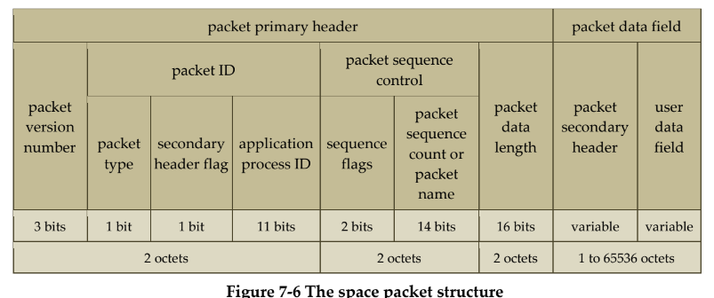

El ***packet primary header*** se ha definido en este caso usando un contenedor compuesto de 2 parámetros y 2 contenedores. 
* **Contenedores**: Están definidos todos juntos en el archivo `pus.xml` como se muestra en la siguiente sección de código

```
<xtce:SequenceContainer name="PH">
    <xtce:EntryList>
        <xtce:ParameterRefEntry parameterRef="version"/>
        <xtce:ContainerRefEntry containerRef="packet_id"/>
        <xtce:ContainerRefEntry containerRef="packet_sequence_control"/>
        <xtce:ParameterRefEntry parameterRef="packet_data_length"/>
    </xtce:EntryList>
</xtce:SequenceContainer>

<xtce:SequenceContainer name="packet_id">
    <xtce:EntryList>
        <xtce:ParameterRefEntry parameterRef="packet_type"/>
        <xtce:ParameterRefEntry parameterRef="secondary_header_flag"/>
        <xtce:ParameterRefEntry parameterRef="application_process_id"/>
    </xtce:EntryList>
</xtce:SequenceContainer>

<xtce:SequenceContainer name="packet_sequence_control">
    <xtce:EntryList>
        <xtce:ParameterRefEntry parameterRef="sequence_flags"/>
        <xtce:ParameterRefEntry parameterRef="packet_sequence_count"/>
    </xtce:EntryList>
</xtce:SequenceContainer>
```

* **Parámetros** definidos en el **set de parámetros** de `pus.xml`. Notar que los tipos de parámetros (`uint3_t` y `uint16_t`) están definidos en el archivo `dt.xml`

```
<xtce:Parameter parameterTypeRef="dt/uint3_t" name="version"/>
<xtce:Parameter parameterTypeRef="dt/uint16_t" name="packet_data_length"/>
```
```
<xtce:IntegerParameterType name="uint16_t" signed="false">
    <xtce:IntegerDataEncoding encoding="unsigned" sizeInBits="16" />
</xtce:IntegerParameterType>
.
.
.
<xtce:IntegerParameterType name="uint3_t" signed="false">
    <xtce:IntegerDataEncoding encoding="unsigned" sizeInBits="3" />
</xtce:IntegerParameterType>
```


#### *Secondary TM Header*
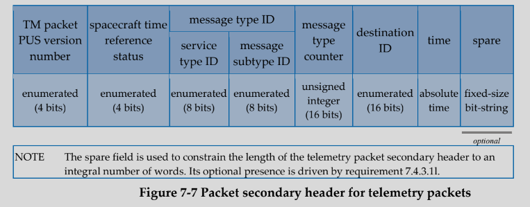

El ***packet secondary header*** se ha definido en este caso usando un contenedor compuesto de 5 parámetros y 1 contenedor. Ocurre los mismo que antes con los contenedores y archivos en cuanto a la distribución de archivos se refiere.

```
<xtce:SequenceContainer name="SH">
    <xtce:EntryList>
        <xtce:ParameterRefEntry parameterRef="tm_PUS_version"/>
        <xtce:ParameterRefEntry parameterRef="spacecraft_time_reference_status"/>
        <xtce:ContainerRefEntry containerRef="message_type_id"/>
        <xtce:ParameterRefEntry parameterRef="message_type_counter"/>
        <xtce:ParameterRefEntry parameterRef="destination_id"/>
        <xtce:ParameterRefEntry parameterRef="time"/>
    </xtce:EntryList>
</xtce:SequenceContainer>

<xtce:SequenceContainer name="message_type_id">
    <xtce:EntryList>
        <xtce:ParameterRefEntry parameterRef="service_type_id" />
        <xtce:ParameterRefEntry parameterRef="message_subtype_id" />
    </xtce:EntryList>
</xtce:SequenceContainer>
```

#### Resultados

Todas estas modificaciones de código han añadido cambios en la interfaz web. 

| Antes de las modificaciones | Después de las modificaciones |
|          --------------     |         --------------        |
|  | 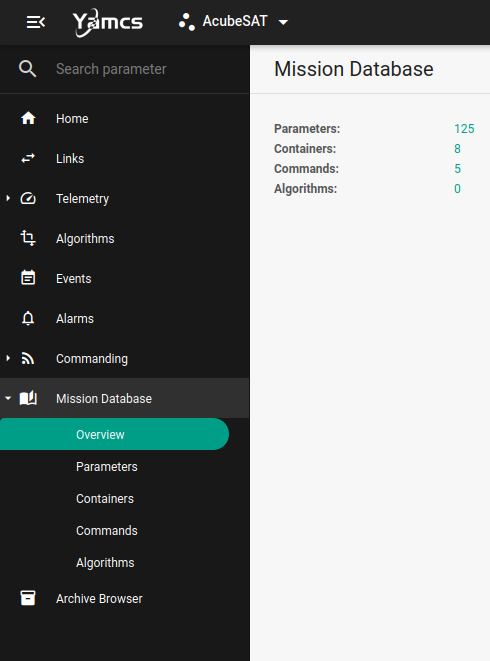 |

Estos cambios han añadido:

* 15 parámetros

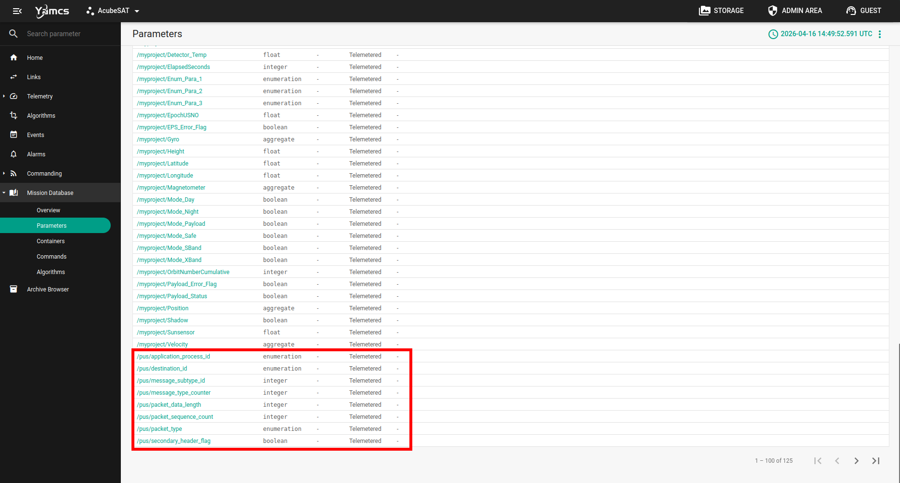
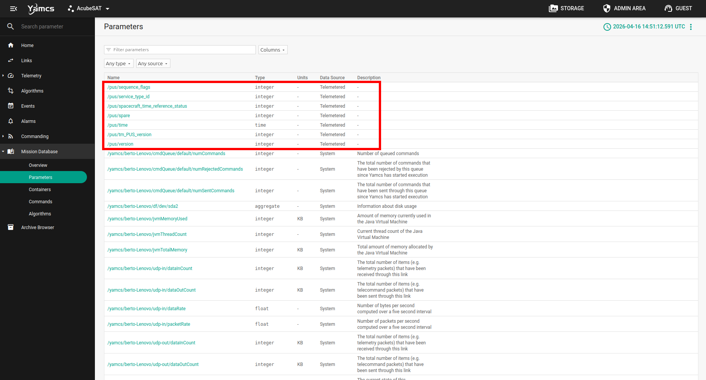

* 5 contenedores

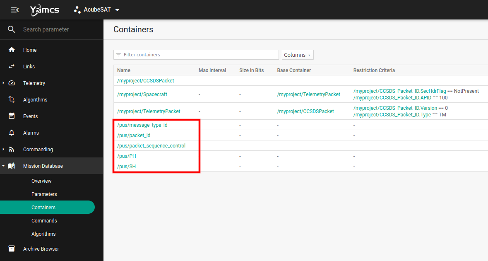

### Paso 5: Creación de un contenedor para telemetría
Crea un [*TM[200,100] container*](https://ccsds.org/Pubs/660x1g2.pdf#page=229) (apartado 5.2 del documento).

Crea un contenedor «TM_header», que incluya los encabezados TM primario y secundario de la tarea [n.º4](https://gitlab.com/acubesat/ops/yamcs-training/-/issues/4), y utilízalo como ```BaseContainer```.

El contenedor tendrá 3 parámetros:
1. parameter (tipo uint16_t)
2. flag (tipo booleano)
3. time (tipo de parámetro de tiempo absoluto creado en la tarea [n.º3](https://gitlab.com/acubesat/ops/yamcs-training/-/issues/3))

El código que crea el contenedor es el siguiente:

```
<xtce:SequenceContainer name="TM_200_100">
    <xtce:EntryList>
        <xtce:ParameterRefEntry parameterRef="time"/>
        <xtce:ParameterRefEntry parameterRef="flag"/>
        <xtce:ParameterRefEntry parameterRef="parameter"/>
    </xtce:EntryList>
    <xtce:BaseContainer containerRef="TM_header">
        <xtce:RestrictionCriteria>
            <xtce:ComparisonList>
                <xtce:Comparison value="200" parameterRef="service_type_id"/>
                <xtce:Comparison value="100" parameterRef="message_subtype_id"/>
            </xtce:ComparisonList>
        </xtce:RestrictionCriteria>
    </xtce:BaseContainer>
</xtce:SequenceContainer>

<xtce:SequenceContainer name="TM_header" abstract="true">
    <xtce:EntryList>
        <xtce:ContainerRefEntry containerRef="PH"/>
        <xtce:ContainerRefEntry containerRef="SH"/>
    </xtce:EntryList>
</xtce:SequenceContainer>
```

Se han tenido que añadir 2 parámetros al set de parámetros:

```
<xtce:Parameter parameterTypeRef="dt/bool_t" name="flag"/>
<xtce:Parameter parameterTypeRef="dt/uint16_t" name="parameter"/>
```

#### Resultados

Todas estas modificaciones de código han añadido cambios en la interfaz web. 

| Antes de las modificaciones | Después de las modificaciones |
|          --------------     |         --------------        |
|  | 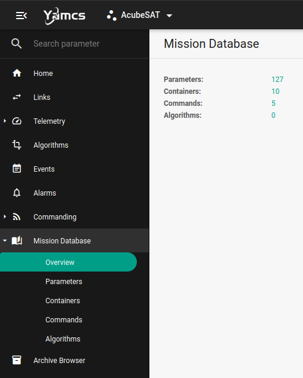 |

Estos cambios han añadido:

* 2 parámetros

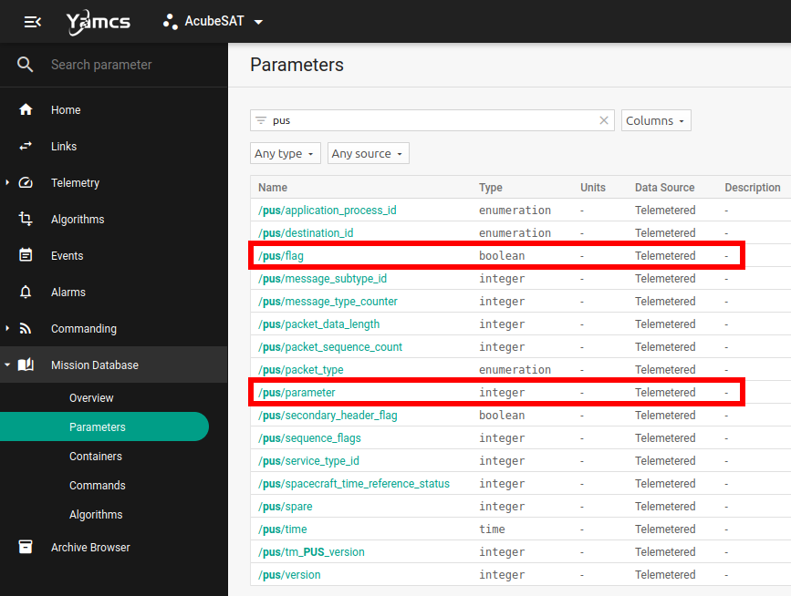

* 2 contenedores

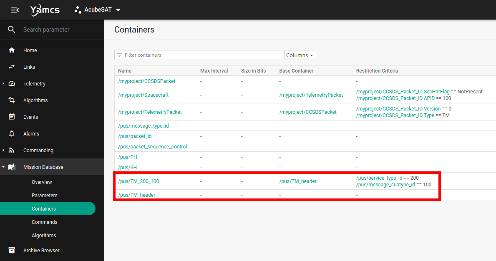

### Paso 6: Creación de telemetría
Durante la misión, la estación terrestre recibirá algunos parámetros de la nave espacial. Por este motivo, se implementa el TM[3,25], denominado «Informe de parámetros de mantenimiento». Contiene una serie de parámetros y sus valores, muestreados a intervalos de tiempo específicos (véase también el apartado 6.3.3.3 del [documento ECSS](https://cloud.spacedot.gr/index.php/apps/files/?dir=/AcubeSAT/Subsystems/OBC%20-%20On-board%20Computer/Standards&openfile=18872)).
Los parámetros utilizados en la misión se dividen en grupos según diversos criterios, como el intervalo de tiempo de sus muestreos, para formar parte del TM[3,25]. Estos grupos se denominan estructuras de mantenimiento y cada uno tiene un identificador único.
Los TM no solo contienen los datos de telemetría, sino también encabezados, que incluyen algunos datos importantes relativos a la identificación de cada paquete. Utilizando los contenedores que creaste en la tarea [n.º 4](https://gitlab.com/acubesat/ops/yamcs-training/-/issues/4), tu objetivo es crear la estructura del TM[3,25].

* Para implementar el TM[3,25], al igual que en la tarea [n.º 5](https://gitlab.com/acubesat/ops/yamcs-training/-/issues/5), debes definir un `SequenceContainer` con el `BaseContainer` y los `RestrictionCriteria` adecuados. El único elemento `EntryList` del contenedor debe ser un parámetro para el structure_ID (consulta también el apartado 8.3.2.13 del [documento ECSS](https://cloud.spacedot.gr/index.php/apps/files/?dir=/AcubeSAT/Subsystems/OBC%20-%20On-board%20Computer/Standards&openfile=18872)).
* A continuación, crearás un nuevo tipo de enumeración de 8 bits para el structure_ID. Los valores serán todos los ID de las estructuras de mantenimiento. A continuación se muestran los ID y los elementos de las estructuras de mantenimiento.
* También se crearán dos estructuras de mantenimiento en `SequenceContainers` utilizando como `BaseContainer` el contenedor TM[3,25] y como `RestrictionCriteria` el valor del structure_ID. Las dos estructuras de mantenimiento son las siguientes:

1. housekeeping_structure_ID = 0
  * `/AcubeSAT/obdhBoardTemperature1`
  * `/AcubeSAT/obdhBoardTemperature2`
  * `/AcubeSAT/obcMCUTemperature`
  * `/AcubeSAT/obcBootCounter`
  * `/AcubeSAT/obcOnBoardTime`
  * `/AcubeSAT/obcNANDCurrentlyUsedMemoryPartition`
  * `/AcubeSAT/obcMCUSysTick`
  * `/AcubeSAT/CANbus1Load`
  * `/AcubeSAT/CANbus2Load`
  * `/AcubeSAT/activeCAN`
  * `/AcubeSAT/obcNANDFLASHLCLThreshold`
  * `/AcubeSAT/obcMRAMLCLThreshold`
  * `/AcubeSAT/obcNANDFLASHON`
  * `/AcubeSAT/obcMRAMON`

2. housekeeping_structure_ID = 1
  * `/AcubeSAT/magnetometerRawX`
  * `/AcubeSAT/magnetometerRawY`
  * `/AcubeSAT/magnetometerRawZ`
  * `/AcubeSAT/gyroscopeX`
  * `/AcubeSAT/gyroscopeY`
  * `/AcubeSAT/gyroscopeZ`

**¡Ojo!** Algunos de los parámetros aún no están definidos en el archivo `xtce.xml`. Encontrarás toda la información sobre sus definiciones en el [código de OBC](https://gitlab.com/acubesat/obc/cross-platform-software/-/blob/main/inc/Parameters/AcubeSATParameters.hpp?ref_type=heads).
Ya sabes [dónde](https://public.ccsds.org/Pubs/660x1g2.pdf) y [cómo](https://gitlab.com/acubesat/ops/yamcs-instance/-/wikis/2.-Containers) encontrar más información.

#### Código añadido

##### 1. Tipos de parámetros nuevos

Es necesario crear el siguiente tipo de dato para el identificador de la estructura en el archivo `dt.xml`:

```
<xtce:EnumeratedParameterType name="housekeeping_structure_ID">
    <xtce:IntegerDataEncoding sizeInBits="8"/>
    <xtce:EnumerationList>
        <xtce:Enumeration value="0" label="HK_OBC" />
        <xtce:Enumeration value="1" label="HK_ADCS" />
    </xtce:EnumerationList>
</xtce:EnumeratedParameterType>
```

##### 2. Parámetros a añadir en `xtce.xml`

Es necesario añadir los siguientes parámetros para la estructura de valor 0 en el archivo `xtce.xml`:

```
<xtce:Parameter parameterTypeRef="/dt/uint8_t" name="obcNANDCurrentlyUsedMemoryPartition"></xtce:Parameter>
<xtce:Parameter parameterTypeRef="/dt/uint8_t" name="activeCAN"></xtce:Parameter>
```

##### 3. Instanciar parámetros

Es necesario instanciar el siguiente parámetros en el set de parámetros del archivo `pus.xml`:

```
<xtce:Parameter parameterTypeRef="dt/housekeeping_structure_ID" name="structure_ID"/>
```

##### 4. Creación de contenedores

Se crea la siguiente jerarquía de contenedores en el archivo `pus.xml`:

```
            <xtce:SequenceContainer name="TM_3_25" abstract="true">

                <xtce:EntryList>
                    <xtce:ParameterRefEntry parameterRef="structure_ID"/>
                </xtce:EntryList>

                <xtce:BaseContainer containerRef="TM_header">
                    <xtce:RestrictionCriteria>
                        <xtce:ComparisonList>
                            <xtce:Comparison value="3" parameterRef="service_type_id"/>
                            <xtce:Comparison value="25" parameterRef="message_subtype_id"/>
                        </xtce:ComparisonList>
                    </xtce:RestrictionCriteria>
                </xtce:BaseContainer>

            </xtce:SequenceContainer>

            <xtce:SequenceContainer name="TM_HK_OBC">

                <xtce:EntryList>
                    <xtce:ParameterRefEntry parameterRef="/AcubeSAT/obdhBoardTemperature1"/> 
                    <xtce:ParameterRefEntry parameterRef="/AcubeSAT/obdhBoardTemperature2"/>
                    <xtce:ParameterRefEntry parameterRef="/AcubeSAT/obcMCUTemperature"/>
                    <xtce:ParameterRefEntry parameterRef="/AcubeSAT/obcBootCounter"/>
                    <xtce:ParameterRefEntry parameterRef="/AcubeSAT/obcOnBoardTime"/>
                    <xtce:ParameterRefEntry parameterRef="/AcubeSAT/obcNANDCurrentlyUsedMemoryPartition"/>
                    <xtce:ParameterRefEntry parameterRef="/AcubeSAT/obcMCUSysTick"/>
                    <xtce:ParameterRefEntry parameterRef="/AcubeSAT/CANbus1Load"/>
                    <xtce:ParameterRefEntry parameterRef="/AcubeSAT/CANbus2Load"/>
                    <xtce:ParameterRefEntry parameterRef="/AcubeSAT/activeCAN"/>
                    <xtce:ParameterRefEntry parameterRef="/AcubeSAT/obcNANDFLASHLCLThreshold"/>
                    <xtce:ParameterRefEntry parameterRef="/AcubeSAT/obcMRAMLCLThreshold"/>
                    <xtce:ParameterRefEntry parameterRef="/AcubeSAT/obcNANDFLASHON"/>
                    <xtce:ParameterRefEntry parameterRef="/AcubeSAT/obcMRAMON"/>
                </xtce:EntryList>

                <xtce:BaseContainer containerRef="TM_3_25">
                    <xtce:RestrictionCriteria>
                        <xtce:ComparisonList>
                            <xtce:Comparison value="0" parameterRef="structure_ID"/>
                        </xtce:ComparisonList>
                    </xtce:RestrictionCriteria>
                </xtce:BaseContainer>

            </xtce:SequenceContainer>

            <xtce:SequenceContainer name="TM_HK_ADCS">

                <xtce:EntryList>
                    <xtce:ParameterRefEntry parameterRef="/AcubeSAT/magnetometerRawX"/> 
                    <xtce:ParameterRefEntry parameterRef="/AcubeSAT/magnetometerRawY"/>
                    <xtce:ParameterRefEntry parameterRef="/AcubeSAT/magnetometerRawZ"/>
                    <xtce:ParameterRefEntry parameterRef="/AcubeSAT/gyroscopeX"/>
                    <xtce:ParameterRefEntry parameterRef="/AcubeSAT/gyroscopeY"/>
                    <xtce:ParameterRefEntry parameterRef="/AcubeSAT/gyroscopeZ"/>
                </xtce:EntryList>

                <xtce:BaseContainer containerRef="TM_3_25">
                    <xtce:RestrictionCriteria>
                        <xtce:ComparisonList>
                            <xtce:Comparison value="1" parameterRef="structure_ID"/>
                        </xtce:ComparisonList>
                    </xtce:RestrictionCriteria>
                </xtce:BaseContainer>

            </xtce:SequenceContainer>
```

#### Resultados:

Todas estas modificaciones de código han añadido cambios en la interfaz web. 

| Antes de las modificaciones | Después de las modificaciones |
|          --------------     |         --------------        |
|  |  |

Estos cambios han añadido:

* 3 parámetros (1 en `/pus` y los otros 2 en `/AcubeSAT`)


* 3 contenedores

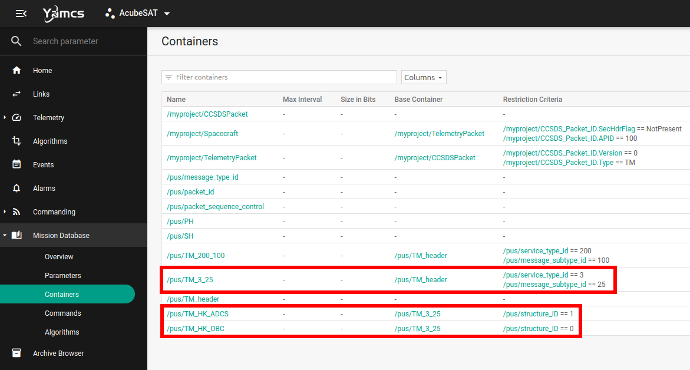

### Paso 7: Creación de telecomandos

Debe crear el TC[3,27] para generar un informe único de las estructuras de los informes de parámetros de mantenimiento (consulte también el apartado 6.3.3.7 del [documento ECSS](https://cloud.spacedot.gr/index.php/apps/files/?dir=/AcubeSAT/Subsystems/OBC%20-%20On-board%20Computer/Standards&openfile=18872)).

1. En primer lugar, debe crear los encabezados (primario y secundario) para los TC. En el caso de los TC, no puede crear dos contenedores separados para los dos encabezados, como hizo con los TM en la tarean [nº 4](https://gitlab.com/acubesat/ops/yamcs-training/-/issues/4). Tendrá que crear un único contenedor [MetaCommand 4.4.5.2](https://public.ccsds.org/Pubs/660x1g2.pdf#page=206) con todos los parámetros de las cabeceras de los TC primario y secundario tal y como se mencionan en la norma ECSS (ahora los argumentos tienen el mismo uso que tenían los parámetros en la sección de telemetría y los metacomandos como contenedores). Consulte la [página wiki](https://gitlab.com/acubesat/ops/yamcs-instance/-/wikis/2.-Containers#metacommands-and-commandcontainers) para obtener más detalles sobre la creación de comandos.

    Debe tener en cuenta que algunos campos de los encabezados TC ya están configurados (su valor está determinado), tal y como se indica en el documento ECSS. Los valores constantes se asignarán a cada campo en una `ArgumentAssignmentList`. Notas importantes:

    * en cuanto a `acknowledgement_flags`, tenga en cuenta que, según el apartado 7.4.4.1 del protocolo ECSS, no solicitamos ningún informe
    * el valor de `source_ID` puede establecerse en 5
    * los parámetros: `application_process_ID`, `service_type_ID` y `message_subtype_ID` no deben incluirse en la `ArgumentAssignmentList`
    * los parámetros: `packet_sequence_count` o `packet_name` y `packet_data_length` dependen de cada paquete transmitido y son gestionados por el PostProcessor. Por ese motivo, deben definirse en la `EntryList` del contenedor utilizando el elemento `FixedValueEntry`.

2. A continuación, crea un contenedor `MetaCommand` utilizando como `BaseMetaCommand` el contenedor de encabezado TC que acabas de crear. Este debe contener una `ArgumentAssignmentList` con los siguientes elementos:
* `service_type_ID` = 3
* `message_type_ID` = 27

3. Consulte el apartado 8.3.2.15 de la [norma ECSS](https://cloud.spacedot.gr/index.php/apps/files/?dir=/AcubeSAT/Subsystems/OBC%20-%20On-board%20Computer/Standards&openfile=18872) para determinar `Arguments` necesarios para la `ArgumentList` del TC[3,27]. El número de estructuras de gestión interna que se incluirán en el contenedor será 3.

#### Código añadido

##### 1. Tipos de parámetros nuevos

Es necesario crear los siguientes tipos de datos para **comandos** (es decir dentro de las etiquetas `<xtce:CommandMetaData>` y su vez `xtce:ArgumentTypeSet`) en el archivo `dt.xml`:

* Parámetros enteros sin signo:
```
<xtce:IntegerArgumentType name="uint1_t" signed="false">
    <xtce:IntegerDataEncoding encoding="unsigned" sizeInBits="1" />
</xtce:IntegerArgumentType>
```
```
<xtce:IntegerArgumentType name="uint2_t" signed="false">
    <xtce:IntegerDataEncoding encoding="unsigned" sizeInBits="2" />
</xtce:IntegerArgumentType>
```
```
<xtce:IntegerArgumentType name="uint3_t" signed="false">
    <xtce:IntegerDataEncoding encoding="unsigned" sizeInBits="3" />
</xtce:IntegerArgumentType>
```
```         
<xtce:IntegerArgumentType name="uint4_t" signed="false">
    <xtce:IntegerDataEncoding encoding="unsigned" sizeInBits="4" />
</xtce:IntegerArgumentType>
```

* Parámetros enumerados:
```
<xtce:EnumeratedArgumentType name="housekeeping_structure_ID">
    <xtce:IntegerDataEncoding sizeInBits="8"/>
    <xtce:EnumerationList>
        <xtce:Enumeration value="0" label="HK_OBC" />
        <xtce:Enumeration value="1" label="HK_ADCS" />
    </xtce:EnumerationList>
</xtce:EnumeratedArgumentType>
```
```
<xtce:EnumeratedArgumentType name="APID">
    <xtce:IntegerDataEncoding sizeInBits="11"/>
    <xtce:EnumerationList>
        <xtce:Enumeration value="0" label="ADCS" />
        <xtce:Enumeration value="1" label="COMMS" />
        <xtce:Enumeration value="2" label="Gs" />
        <xtce:Enumeration value="3" label="OBC" />
        <xtce:Enumeration value="4" label="SU" />
        <!-- en IDLE tienen que estar todos los bits a 1-->
        <xtce:Enumeration value="2047" label="IdlePacket" />
    </xtce:EnumerationList>
</xtce:EnumeratedArgumentType>
```
```
<xtce:EnumeratedArgumentType name="PacketType">
    <xtce:IntegerDataEncoding sizeInBits="1"></xtce:IntegerDataEncoding>
    <xtce:EnumerationList>
        <xtce:Enumeration value="0" label="TM" />
        <xtce:Enumeration value="1" label="TC" />
    </xtce:EnumerationList>
</xtce:EnumeratedArgumentType>
```

##### 2. Telecomando añadido

```
<xtce:MetaCommand name="TC_header" abstract="true">
    <xtce:ArgumentList>
        <xtce:Argument argumentTypeRef="dt/uint3_t" name="version"/>
        <xtce:Argument argumentTypeRef="dt/PacketType" name="packet_type"/>
        <xtce:Argument argumentTypeRef="dt/uint1_t" name="secondary_header_flag"/>
        <xtce:Argument argumentTypeRef="dt/APID" name="application_process_ID"/>
        <xtce:Argument argumentTypeRef="dt/uint2_t" name="sequence_flags"/>
        <xtce:Argument argumentTypeRef="dt/uint4_t" name="ccsds_secondary_header_version"/>
        <xtce:Argument argumentTypeRef="dt/uint4_t" name="acknowledgement_flags"/>
        <xtce:Argument argumentTypeRef="dt/uint8_t" name="service_type_ID"/>
        <xtce:Argument argumentTypeRef="dt/uint8_t" name="message_subtype_ID"/>
        <xtce:Argument argumentTypeRef="dt/uint16_t" name="source_ID"/>
    </xtce:ArgumentList>

    <xtce:CommandContainer name="TC_header">
        <xtce:EntryList>
            <xtce:ArgumentRefEntry argumentRef="version"/>
            <xtce:ArgumentRefEntry argumentRef="packet_type"/>
            <xtce:ArgumentRefEntry argumentRef="secondary_header_flag"/>
            <xtce:ArgumentRefEntry argumentRef="application_process_ID"/>
            <xtce:ArgumentRefEntry argumentRef="sequence_flags"/>
            <xtce:FixedValueEntry name="packet_sequence_count" binaryValue="00000000000000" sizeInBits="14" />
            <xtce:FixedValueEntry name="packet_data_length" binaryValue="0000000000000000" sizeInBits="16" />
            <xtce:ArgumentRefEntry argumentRef="ccsds_secondary_header_version"/>
            <xtce:ArgumentRefEntry argumentRef="acknowledgement_flags"/>
            <xtce:ArgumentRefEntry argumentRef="service_type_ID"/>
            <xtce:ArgumentRefEntry argumentRef="message_subtype_ID"/>
            <xtce:ArgumentRefEntry argumentRef="source_ID"/>
        </xtce:EntryList>
    </xtce:CommandContainer>
</xtce:MetaCommand>
```
```
<xtce:MetaCommand name="TC_3_27_GenerateReport">
    <xtce:BaseMetaCommand metaCommandRef="TC_header">
        <xtce:ArgumentAssignmentList>
            <xtce:ArgumentAssignment argumentName="acknowledgement_flags" argumentValue="0"/>
            <xtce:ArgumentAssignment argumentName="source_ID" argumentValue="5"/>
            <xtce:ArgumentAssignment argumentName="service_type_ID" argumentValue="3"/>
            <xtce:ArgumentAssignment argumentName="message_subtype_ID" argumentValue="27"/>
        </xtce:ArgumentAssignmentList>
    </xtce:BaseMetaCommand>
    <xtce:ArgumentList>
        <xtce:Argument argumentTypeRef="dt/housekeeping_structure_ID" name="structure_ID_1"/>
        <xtce:Argument argumentTypeRef="dt/housekeeping_structure_ID" name="structure_ID_2"/>
        <xtce:Argument argumentTypeRef="dt/housekeeping_structure_ID" name="structure_ID_3"/>
    </xtce:ArgumentList>

    <xtce:CommandContainer name="TC_3_27_GenerateReport">
        <xtce:EntryList>
            <xtce:ArgumentRefEntry argumentRef="structure_ID_1"/>
            <xtce:ArgumentRefEntry argumentRef="structure_ID_2"/>
            <xtce:ArgumentRefEntry argumentRef="structure_ID_3"/>
        </xtce:EntryList>
        <xtce:BaseContainer containerRef="TC_header"/>
    </xtce:CommandContainer>
</xtce:MetaCommand>
```

#### Resultados:

Todas estas modificaciones de código han añadido cambios en la interfaz web. 

| Antes de las modificaciones | Después de las modificaciones |
|          --------------     |         --------------        |
|  | 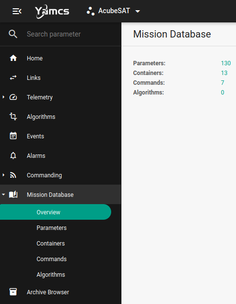 |

Como se observa en las imágenes se han añadido **2 comandos**, **3 contenedores** y **3 parámetros**:

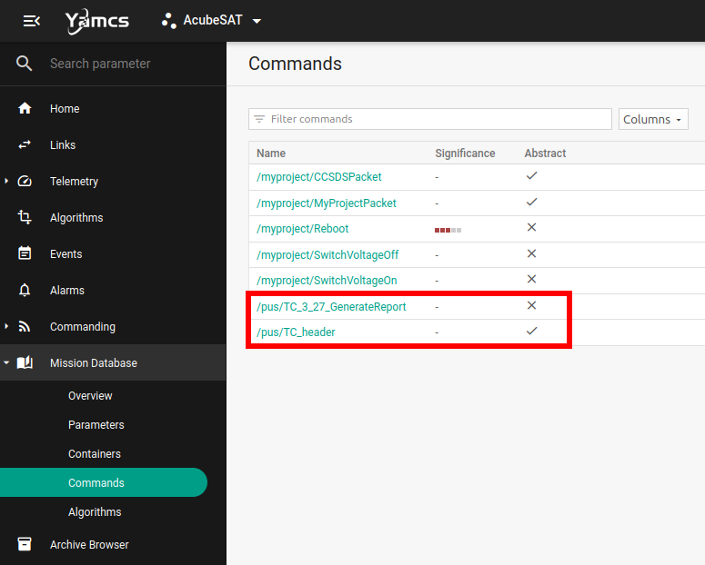

### Paso 8:

Algunos servicios requieren el envío de estructuras de datos creadas dinámicamente, lo que significa que no podemos saber con certeza cuál es su tamaño. Un ejemplo es el informe de estadísticas de parámetros TM[4,2]. Para implementarlo, debemos definir una matriz de estructuras de estadísticas.

Este TM consta del contenedor base «TM_header» que creaste en una tarea anterior (con ID de servicio = 4 e ID de tipo de mensaje = 2), además de:

1. Hora de inicio del informe (`uint32_t`)
2. Hora de finalización del informe (`uint32_t`)
3. Número de estructuras de estadísticas (`uint16_t`)
4. Matriz de las estructuras. Cada estructura contiene:
    * ID del parámetro (tipo parameter_id, ya definido en dt.xml)
    * Número de muestras (`uint16_t`)
    * max_value (`float_t`)
    * max_time (`uint32_t`)
    * min_value (`float_t`)
    * min_time (`uint32_t`)
    * mean_value (`float_t`)
    * standard_deviation (`float_t`)

Debe definir la estructura del informe *parameter_statistics* utilizando el elemento `AggregateParameterType`. El TM contendrá los tres primeros valores y, a continuación, una matriz unidimensional de tipo `parameter_statistics` y tamaño igual al número total de parámetros. Esto se puede definir utilizando el elemento `DimentionList` y un `DynamicValue` para el `EndingIndex`. El valor del elemento `EndingIndex` debe establecerse en uno menos que la dimensión real de la estructura. El elemento `LinearAdjustment` te ayudará.

Para probar tu implementación, envía este paquete a través de `simulator.py`:

```
array = [8, 1, 195, 39, 0, 76, 32, 4, 2, 1, 70, 0, 1, 37, 165, 61, 202, 14, 224, 184, 148, 14, 224, 185, 92, 0, 2, 19, 152, 0, 3, 64, 160, 0, 0, 14, 224, 185, 92, 63, 128, 0, 0, 14, 224, 185, 92, 64, 64, 0, 0, 63, 209, 5, 236, 19, 153, 0, 6, 65, 80, 0, 0, 14, 224, 185, 92, 64, 64, 0, 0, 14, 224, 185, 92, 65, 0, 0, 0, 0, 0, 0, 0]
```

#### Código añadido

##### Parámetros:

Se han añadido los siguientes parámetros en el archivo `dt.xml`

* Parámetro **agregado** para telemetría: es importante la posición de este tipo de parámetro en el código. Debe estar antes de la declaración de los parámetros en su interior

```
<xtce:AggregateParameterType name="parameter_statistics_struct">
    <xtce:MemberList>
        <xtce:Member typeRef="parameter_ID" name="parameter_ID" />
        <xtce:Member typeRef="uint16_t" name="samples" />
        <xtce:Member typeRef="float_t" name="max_value" />
        <xtce:Member typeRef="uint32_t" name="max_time" />
        <xtce:Member typeRef="float_t" name="min_value" />
        <xtce:Member typeRef="uint32_t" name="min_time" />
        <xtce:Member typeRef="float_t" name="mean_value" />
        <xtce:Member typeRef="float_t" name="standard_deviation" />
    </xtce:MemberList>
</xtce:AggregateParameterType>
```

* Parámetro **enumerado** para telecomandos
```
<xtce:EnumeratedArgumentType name="APID_16">
    <xtce:IntegerDataEncoding sizeInBits="16">
    </xtce:IntegerDataEncoding>
    <xtce:EnumerationList>
        <xtce:Enumeration value="0" label="ADCS" />
        <xtce:Enumeration value="1" label="COMMS" />
        <xtce:Enumeration value="2" label="GS" />
        <xtce:Enumeration value="3" label="OBC" />
        <xtce:Enumeration value="4" label="SU" />
    </xtce:EnumerationList>
</xtce:EnumeratedArgumentType> 
```

Además, se han realizado cambios en los parámetros en el archivo `pus.xml`

* Se añade un nuevo set de parámetros, concretamente un array:

```
<xtce:ParameterTypeSet>
    <xtce:ArrayParameterType name="parameter_statistics_array_type" arrayTypeRef="dt/parameter_statistics_struct">
        <xtce:DimensionList>
            <xtce:Dimension>
                <xtce:StartingIndex>
                    <xtce:FixedValue>0</xtce:FixedValue>
                </xtce:StartingIndex>
                <xtce:EndingIndex>
                    <xtce:DynamicValue>
                        <xtce:ParameterInstanceRef parameterRef="number_of_statistic_structures" />
                        <xtce:LinearAdjustment intercept="-1" />
                    </xtce:DynamicValue>
                </xtce:EndingIndex>
            </xtce:Dimension>
        </xtce:DimensionList>
    </xtce:ArrayParameterType>
</xtce:ParameterTypeSet>
```

* Se modifca el tipo de parámetro para el `destination_id`:

```
<xtce:Parameter parameterTypeRef="dt/uint16_t" name="destination_id"/>
```

* Se añaden los siguientes parámetros al set de parámetros definido desde el principio:

```
<xtce:Parameter parameterTypeRef="dt/uint32_t" name="start_time"/>
<xtce:Parameter parameterTypeRef="dt/uint32_t" name="end_time"/>
<xtce:Parameter parameterTypeRef="dt/uint16_t" name="number_of_statistic_structures"/>
<xtce:Parameter parameterTypeRef="parameter_statistics_array_type" name="parameter_statistics_array"/>
```

##### Contenedores

* Se han modificado los siguientes `SequenceContainer` :

*Primary Header*

```
<xtce:SequenceContainer name="PH">
    <xtce:EntryList>
        <xtce:ParameterRefEntry parameterRef="version"/>
        <xtce:ParameterRefEntry parameterRef="packet_type"/>
        <xtce:ParameterRefEntry parameterRef="secondary_header_flag"/>
        <xtce:ParameterRefEntry parameterRef="application_process_id"/>
        <xtce:ParameterRefEntry parameterRef="sequence_flags"/>
        <xtce:ParameterRefEntry parameterRef="packet_sequence_count"/>
        <xtce:ParameterRefEntry parameterRef="packet_data_length"/>
    </xtce:EntryList>
</xtce:SequenceContainer>
```
    
*Secondary Header*

```
<xtce:SequenceContainer name="SH">
    <xtce:EntryList>
        <xtce:ParameterRefEntry parameterRef="tm_PUS_version"/>
        <xtce:ParameterRefEntry parameterRef="spacecraft_time_reference_status"/>
        <xtce:ParameterRefEntry parameterRef="service_type_id"/>
        <xtce:ParameterRefEntry parameterRef="message_subtype_id"/>
        <xtce:ParameterRefEntry parameterRef="message_type_counter"/>
        <xtce:ParameterRefEntry parameterRef="destination_id"/>
        <xtce:ParameterRefEntry parameterRef="time"/>
    </xtce:EntryList>
    <xtce:BaseContainer containerRef="PH"/>
</xtce:SequenceContainer>
```

*TM_header*
```
<xtce:SequenceContainer name="TM_header" abstract="true">
    <xtce:EntryList/> 
    <xtce:BaseContainer containerRef="SH"/>
</xtce:SequenceContainer>
```

* Además, se ha creado el siguiente contenedor

```
<xtce:SequenceContainer name="TM_4_2">
    <xtce:EntryList>
        <xtce:ParameterRefEntry parameterRef="start_time"/>
        <xtce:ParameterRefEntry parameterRef="end_time"/>
        <xtce:ParameterRefEntry parameterRef="number_of_statistic_structures"/>
        <xtce:ParameterRefEntry parameterRef="parameter_statistics_array"/>
    </xtce:EntryList>
    <xtce:BaseContainer containerRef="TM_header">
        <xtce:RestrictionCriteria>
            <xtce:ComparisonList>
                <xtce:Comparison value="4" parameterRef="service_type_id"/>
                <xtce:Comparison value="2" parameterRef="message_subtype_id"/>
            </xtce:ComparisonList>
        </xtce:RestrictionCriteria>
    </xtce:BaseContainer>
</xtce:SequenceContainer>
```

##### Resultados:

Todas estas modificaciones de código han añadido cambios en la interfaz web. 

| Antes de las modificaciones | Después de las modificaciones |
|          --------------     |         --------------        |
|  | 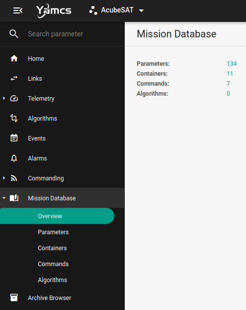 | 

Como se observa en las imágenes siguientes se han añadido:
* **4 parámetros**:

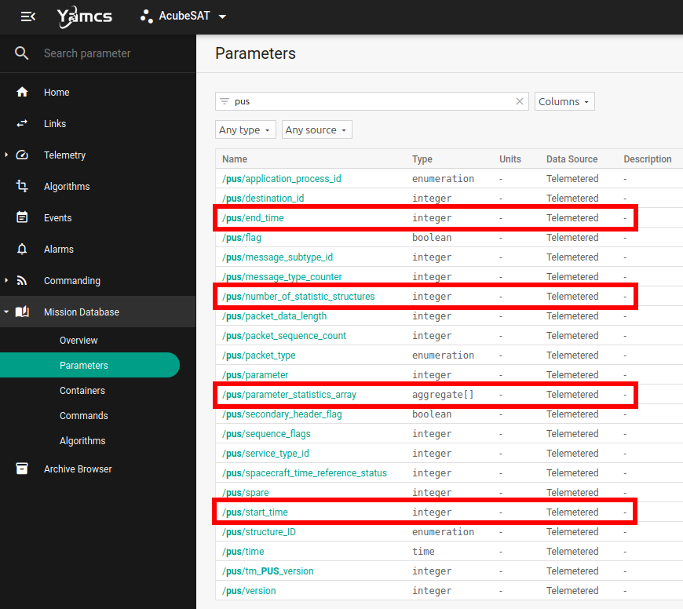

* Se han eliminado **3 contenedores** y se ha añadido **1 nuevo**. Para ello se han eliminado las siguientes secciones de código y se han realizado las modificación mencionada arriba:

```
<xtce:SequenceContainer name="message_type_id">
    <xtce:EntryList>
        <xtce:ParameterRefEntry parameterRef="service_type_id" />
        <xtce:ParameterRefEntry parameterRef="message_subtype_id" />
    </xtce:EntryList>
</xtce:SequenceContainer>
```

```
<xtce:SequenceContainer name="packet_id">
    <xtce:EntryList>
        <xtce:ParameterRefEntry parameterRef="packet_type"/>
        <xtce:ParameterRefEntry parameterRef="secondary_header_flag"/>
        <xtce:ParameterRefEntry parameterRef="application_process_id"/>
    </xtce:EntryList>
</xtce:SequenceContainer>

<xtce:SequenceContainer name="packet_sequence_control">
    <xtce:EntryList>
        <xtce:ParameterRefEntry parameterRef="sequence_flags"/>
        <xtce:ParameterRefEntry parameterRef="packet_sequence_count"/>
    </xtce:EntryList>
</xtce:SequenceContainer>
```

###### Prueba con el simulador:

Para realizar la prueba mencionada en el enunciado, se necesita modificar el archivo `simulator.py`. Se realizan 2 cambios: 

* Se modifica la función `send_tm(simulator)` de la siguiente manera:

```
def send_tm(simulator):
    tm_socket = socket.socket(socket.AF_INET, socket.SOCK_DGRAM)

    # $ T-7
    while True:
        tm_socket.sendto(PACKET, ('127.0.0.1', 10015))
        simulator.tm_counter += 1

        sleep(1)


    # $ T-7
    # with io.open('testdata.ccsds', 'rb') as f:
    #     simulator.tm_counter = 1
    #     header = bytearray(6)
    #     while f.readinto(header) == 6:
    #         (len,) = unpack_from('>H', header, 4)

    #         packet = bytearray(len + 7)
    #         f.seek(-6, io.SEEK_CUR)
    #         f.readinto(packet)
 
    #         tm_socket.sendto(packet, ('127.0.0.1', 10015))
    #         simulator.tm_counter += 1
 
    #         sleep(1)
```

* Se añade el array que se menciona en el enunciado de la tarea

```
PACKET = bytes([
    8, 1, 195, 39, 0, 76, 32, 4, 2, 1, 70, 0, 1, 37, 165,
    61, 202, 14, 224, 184, 148, 14, 224, 185, 92, 0, 2,
    19, 152, 0, 3, 64, 160, 0, 0, 14, 224, 185, 92, 63,
    128, 0, 0, 14, 224, 185, 92, 64, 64, 0, 0, 63, 209,
    5, 236, 19, 153, 0, 6, 65, 80, 0, 0, 14, 224, 185,
    92, 64, 64, 0, 0, 14, 224, 185, 92, 65, 0, 0, 0, 0,
    0, 0, 0
])
```

Para asegurarnos que vemos el resultado correcto, cerramos el servidor si lo teníamos abierto, y ejecutamos `mvn clean` para limpiar el servidor y volvemos a arrancarlo con `mvn yamcs:run`. De esta forma nos evitamos, posibles contaminaciones por haber ejecutado la simulación previamente.

A continuación se muestran el antes y el después de ejecutar la simulación:

| Antes de la simulación | Después de la simulación |
|          --------------     |         --------------        |
| 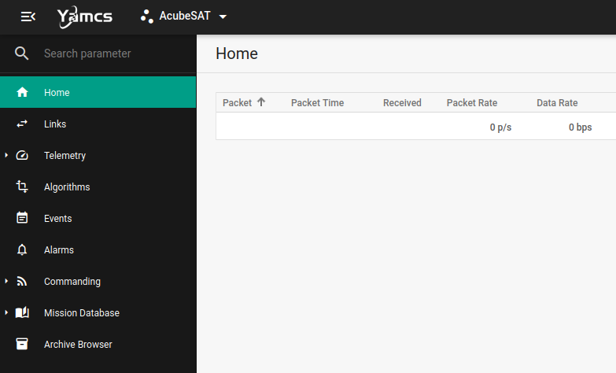 | 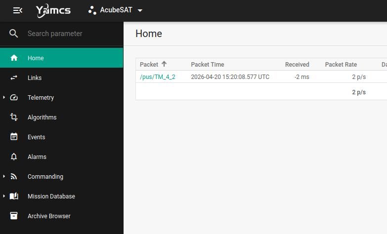  | 

Como se observa, están apareciendo paquetes y estos paquetes encajan con el TM[4,2] que se acaba de crear, por lo tanto, la tarea se ha completado con éxito ✅​.